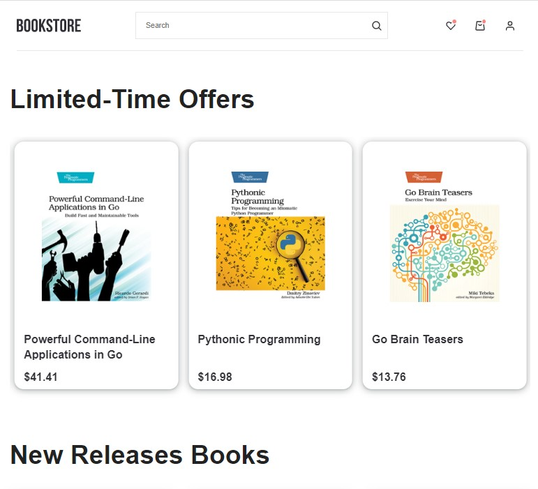

<!-- PROJECT -->
 

    

    ·
    <a href="https://aduenko-vladislav.github.io/bookstore)">View Demo</a>
    · 

### Tools and packages

- [React.js](https://reactjs.org/)
- [Redux Toolkit](https://redux-toolkit.js.org/)
- [React Router](https://reactrouter.com/)
- [React Router Dom](https://www.npmjs.com/package/react-router-dom)
- [React Hook Form](https://react-hook-form.com/)
- [React Slick](https://react-slick.neostack.com/)
- [uuid](https://www.npmjs.com/package/uuid)
- [Axios](https://axios-http.com/docs/intro)
- [Styled-components](https://styled-components.com/)
- [Typescript](https://www.typescriptlang.org/)
- [Firebase](https://firebase.google.com/)
- [Framer Motion](https://www.framer.com/motion/)
- [gh-pages](https://pages.github.com/)

(<a href="#top">back to top</a>)

## About The Project

[![BookStore_1 ][BookStore]](https://prnt.sc/lq_8Q8SaMrgx)
[![BookStore_2 ][BookStore_2]](https://prnt.sc/uJdksegUJm1h)

Enjoy my project [React-Bookstore](https://aduenko-vladislav.github.io/bookstore/).
